# 🧠 SambaNova RAG API with Mastra.ai, Fastify & Supabase

A high-performance RAG (Retrieval-Augmented Generation) API built with Mastra.ai workflows, Fastify and Supabase, powered by SambaNova's AI models.

## 🚀 Features

- **High Performance**: Built with Fastify (3x faster than Express)
- **Document-First RAG**: Select specific documents before querying for precise context
- **Mastra.ai Agent Orchestration**: Advanced RAG workflows with intelligent tool management
- **Multi-Format Support**: Upload PDF, CSV, TXT, MD, DOC, DOCX files with smart content extraction
- **Vector Storage**: Persistent storage with Supabase PostgreSQL + pgvector for similarity search
- **SambaNova AI**: Mistral-7B-Instruct for text generation with conservative rate limiting
- **Real-time Analysis**: Performs calculations on CSV data with complete content access
- **Smart Document Selection**: Query by ID, name, tags, or all documents
- **Enhanced Rate Limiting**: 8-second delays between requests, max 5 requests/minute
- **Intelligent Recommendations**: AI-generated follow-up questions based on query context
- **Source Attribution**: Transparent document usage tracking in responses
- **Type Safe**: Full TypeScript implementation with centralized configuration
- **RESTful API**: Clean REST endpoints with comprehensive document management

## 📋 Prerequisites

- Node.js 18+ 
- npm or yarn
- Supabase account and project
- SambaNova API key

## 🛠️ Quick Setup

### 1. Clone and Install
```bash
git clone <your-repo>
cd sambanova-rag-fastify
npm install
```

### 2. Environment Variables
Copy `.env.example` to `.env` and configure:
```bash
cp .env.example .env
```

Fill in your credentials:
```env
SAMBANOVA_API_KEY=your_sambanova_api_key
SUPABASE_DATABASE_URL=your_supabase_database_url
SUPABASE_SERVICE_ROLE_KEY=your_supabase_service_role_key
PORT=3000
```

### 3. Setup Supabase Database
Run the SQL setup script in your Supabase SQL editor:
```sql
-- See supabase_setup.sql for the complete schema
```

Or follow the detailed setup in [SUPABASE_SETUP.md](./SUPABASE_SETUP.md)

### 4. Start the Server
```bash
# Development
npm run dev

# Production build
npm run build
npm start
```

## 📚 API Endpoints

### Core Endpoints
```
GET    /health                 - Health check
GET    /stats                  - System statistics  
POST   /upload                 - Upload files to Supabase
GET    /documents              - List documents for selection (lightweight)
GET    /view                   - View all documents (detailed)
GET    /view/:id               - View single document
POST   /query                  - Enhanced RAG query with document selection
DELETE /documents/:id          - Delete single document
DELETE /documents              - Clear all documents
```

### Enhanced Query Endpoint
The `/query` endpoint now supports advanced document selection:

```typescript
POST /query
{
  "prompt": string,                    // Required: Your question
  "documentIds"?: string[],            // Optional: Specific document IDs
  "documentNames"?: string[],          // Optional: Document names (partial match)
  "tags"?: string[],                   // Optional: Filter by tags
  "useAllDocuments"?: boolean          // Optional: Use all available documents
}
```

**Workflow:**
1. **Document Selection**: Choose which documents to query against
2. **Context Injection**: Selected documents included in AI prompt
3. **Mastra.ai Processing**: Agent orchestrates the RAG workflow
4. **SambaNova Generation**: Mistral-7B-Instruct generates responses
5. **Enhanced Output**: Includes document selection details and recommendations

### Example Usage

#### 1. Upload Documents
```bash
curl -X POST http://localhost:3000/upload \
  -F "file=@sample-financial-data.csv" \
  -F "tags=[\"financial\", \"2024\"]"
```

#### 2. List Available Documents for Selection
```bash
curl -X GET http://localhost:3000/documents
```
**Response:**
```json
{
  "success": true,
  "data": {
    "totalDocuments": 1,
    "documents": [
      {
        "id": "ea510b57-bc94-470e-b399-520f6c9866a3",
        "name": "sample-financial-data.csv",
        "tags": ["financial", "2024"],
        "contentPreview": "Company,Revenue,Profit,Employees..."
      }
    ],
    "usage": {
      "byId": "Use 'documentIds' array with specific document IDs",
      "byName": "Use 'documentNames' array with document names",
      "byTags": "Use 'tags' array to filter by document tags",
      "all": "Use 'useAllDocuments': true to include all documents"
    }
  }
}
```

#### 3. Enhanced RAG Queries with Document Selection

**Option A: Query Specific Documents by ID**
```bash
curl -X POST http://localhost:3000/query \
  -H "Content-Type: application/json" \
  -d '{
    "prompt": "Which company has the highest revenue per employee?",
    "documentIds": ["ea510b57-bc94-470e-b399-520f6c9866a3"]
  }'
```

**Option B: Query by Document Name (Partial Match)**
```bash
curl -X POST http://localhost:3000/query \
  -H "Content-Type: application/json" \
  -d '{
    "prompt": "Analyze the financial performance data",
    "documentNames": ["financial-data"]
  }'
```

**Option C: Query by Tags**
```bash
curl -X POST http://localhost:3000/query \
  -H "Content-Type: application/json" \
  -d '{
    "prompt": "Show me 2024 financial metrics",
    "tags": ["financial", "2024"]
  }'
```

**Option D: Query All Documents**
```bash
curl -X POST http://localhost:3000/query \
  -H "Content-Type: application/json" \
  -d '{
    "prompt": "What documents do you have access to?",
    "useAllDocuments": true
  }'
```

**Enhanced Response Format:**
```json
{
  "success": true,
  "data": {
    "prompt": "Which company has the highest revenue per employee?",
    "response": "Based on the selected financial document, Apple Inc has the highest revenue per employee at 2.56 (394,328M / 154,000 employees)...",
    "documentSelection": {
      "criteria": ["Document Names: financial-data"],
      "selectedCount": 1,
      "selectedDocuments": [
        {
          "id": "ea510b57-bc94-470e-b399-520f6c9866a3",
          "name": "sample-financial-data.csv",
          "contentLength": 1000,
          "preview": "CSV data with company financials..."
        }
      ]
    },
    "processingTime": "1.4s",
    "system": "Enhanced Mastra.ai + SambaNova + Supabase with Document Selection"
  }
}
```

The query system features:
- **Document-First RAG**: Select specific documents before querying
- **Mastra.ai Agent Orchestration**: Intelligent workflow management
- **SambaNova Rate Limiting**: 8-second delays, 5 requests/minute
- **Real-time Analysis**: Performs calculations on CSV data
- **Source Attribution**: Shows exactly which documents were used

#### 4. System Monitoring
```bash
curl http://localhost:3000/stats
curl http://localhost:3000/health
```

## 🏗️ Architecture & Complete Workflow

### System Architecture

```mermaid
graph TB
    subgraph "Client Layer"
        A[👤 User Application]
    end
    
    subgraph "API Gateway"
        B[🚀 Fastify Server<br/>REST Endpoints]
    end
    
    subgraph "AI Orchestration"
        C[🧠 Mastra.ai Agent]
        C1[🔧 Vector Search Tool]
        C2[🛠️ Recommendation Tool]
    end
    
    subgraph "Data Layer"
        D[🗄️ Supabase]
        D1[PostgreSQL + pgvector]
        D2[File Storage]
    end
    
    subgraph "AI Services"
        E[🤖 SambaNova API]
        E1[Mistral-7B-Instruct]
    end
    
    A --> B
    B --> C
    C --> C1
    C --> C2
    C1 --> D1
    C2 --> E1
    B --> D2
    C --> E
    E --> E1
    E1 --> C
    C --> B
    B --> A
    
    classDef clientStyle fill:#e3f2fd,stroke:#1976d2
    classDef apiStyle fill:#f3e5f5,stroke:#7b1fa2
    classDef aiStyle fill:#fff3e0,stroke:#f57c00
    classDef dbStyle fill:#e8f5e8,stroke:#388e3c
    classDef externalStyle fill:#fce4ec,stroke:#c2185b
    
    class A clientStyle
    class B apiStyle
    class C,C1,C2 aiStyle
    class D,D1,D2 dbStyle
    class E,E1 externalStyle
```



### Technology Stack Integration
- **🚀 Fastify API**: High-performance REST server (3x faster than Express)
- **🗄️ Supabase**: PostgreSQL + pgvector for persistent vector storage + file storage
- **🤖 SambaNova**: Mistral-7B-Instruct for LLM + embeddings with conservative rate limiting
- **🧠 Mastra.ai**: Advanced agent orchestration, tool management, and workflow automation

### 🔄 Complete RAG Workflow

#### **Phase 1: Document Management**
1. **File Upload via Fastify**
   - User uploads documents (CSV, PDF, TXT, etc.) through REST API
   - Fastify handles multipart uploads with validation
   - Files stored in Supabase Storage bucket

2. **Content Processing**
   - Text extraction from various file formats
   - CSV files get complete data included for analysis
   - Content cleaned and prepared for embedding

3. **Vector Generation with SambaNova**
   - Document content sent to SambaNova embedding API
   - Vectors generated using `text-embedding-ada-002` model
   - Rate limiting: 8-second delays between requests

4. **Storage in Supabase**
   - Document content + vectors stored in PostgreSQL
   - pgvector extension enables similarity search
   - Metadata indexed for efficient retrieval

#### **RAG Workflow Process**

```mermaid
graph TD
    A[📤 Document Upload<br/>CSV, PDF, TXT, etc.] --> B[🗄️ Supabase Storage<br/>+ Vector Generation]
    B --> C[📋 Document Selection<br/>by ID, Name, or Tags]
    C --> D[❓ Enhanced Query<br/>with Context]
    D --> E[🧠 Mastra.ai Agent<br/>Orchestration]
    E --> F[🔧 Vector Search<br/>pgvector Similarity]
    E --> G[🤖 SambaNova API<br/>Mistral-7B Processing]
    F --> H[📊 Relevant Context<br/>Retrieved]
    G --> I[💭 AI Response<br/>Generated]
    H --> I
    I --> J[🛠️ Enhancement<br/>+ Recommendations]
    J --> K[✨ Complete Response<br/>with Metadata]
    
    classDef uploadStyle fill:#e8f5e8,stroke:#388e3c
    classDef processStyle fill:#fff3e0,stroke:#f57c00
    classDef aiStyle fill:#fce4ec,stroke:#c2185b
    classDef responseStyle fill:#e3f2fd,stroke:#1976d2
    
    class A,B uploadStyle
    class C,D,E,F,H processStyle
    class G,I aiStyle
    class J,K responseStyle
```



#### **Phase 3: Intelligent Response Generation**

1. **Document Selection (New Feature)**
   ```bash
   # Step 1: List available documents
   GET /documents
   
   # Step 2: Query with specific document selection
   POST /query {
     "prompt": "Your question",
     "documentIds": ["doc-id-1", "doc-id-2"],      # Option A
     "documentNames": ["financial-data"],           # Option B  
     "tags": ["quarterly", "2023"],                # Option C
     "useAllDocuments": true                       # Option D
   }
   ```

2. **Mastra.ai Agent Orchestration**
   - Agent receives user query + selected document context
   - Uses vector search tool to find relevant content
   - Processes through SambaNova Mistral-7B-Instruct model
   - Generates contextual recommendations

3. **Advanced Context Handling**
   - Selected documents included in prompt context
   - AI has access to actual document content
   - Can perform calculations on CSV data
   - Provides source attribution

#### **Phase 4: Response Enhancement**

1. **Multi-Tool Processing**
   - **Vector Search Tool**: Finds relevant document chunks
   - **Recommendation Tool**: Generates follow-up questions
   - **Rate Limiting**: Ensures API compliance

2. **Intelligent Output**
   ```json
   {
     "response": "AI-generated answer based on selected documents",
     "documentSelection": {
       "criteria": ["Document Names: financial-data"],
       "selectedCount": 1,
       "selectedDocuments": [...]
     },
     "recommendations": ["Follow-up question 1", "..."],
     "processingTime": "1.4s",
     "system": "Enhanced Mastra.ai + SambaNova + Supabase"
   }
   ```

### 🎯 Key Workflow Advantages

1. **Document-First RAG**: Users select specific documents before querying
2. **True Context Awareness**: AI has access to complete document content
3. **Intelligent Orchestration**: Mastra.ai agents handle complex workflows
4. **Conservative Rate Limiting**: 8s delays + 5 requests/min for API compliance
5. **Transparent Processing**: Users see exactly which documents were used
6. **Multi-Format Support**: CSV, PDF, TXT, MD, DOC, DOCX files
7. **Real-time Analysis**: Can perform calculations on CSV data in real-time

### 🔧 Technical Implementation

- **Fastify**: High-performance API server (3x faster than Express)
- **Supabase**: PostgreSQL + pgvector for persistent vector storage
- **SambaNova**: Mistral-7B-Instruct for LLM + embeddings with rate limiting
- **Mastra.ai**: Agent orchestration, tool management, and workflow automation

This architecture ensures reliable, scalable, and intelligent RAG processing with proper document selection and context awareness.

## 🔧 Development

### Available Scripts
```bash
npm run dev          # Start development server
npm run build        # Build for production
npm start           # Start production server
npm run build:watch # Watch mode build
npm run clean       # Clean build directory
npm run type-check  # TypeScript type checking
```

### File Structure
```
src/
├── server.ts                 # Main Fastify server
└── supabase-rag-system.ts   # RAG system with Supabase integration

Database:
├── supabase_setup.sql       # Database schema
├── SUPABASE_SETUP.md       # Setup instructions
└── sample-financial-data.csv # Test data
```

## 🚀 Deployment Options

This serverless-ready application can be deployed to:

- **Vercel Functions** (recommended for Node.js)
- **Google Cloud Run** (most flexible, container-based)
- **Fly.io** (excellent developer experience)
- **Railway** (easiest migration from traditional hosting)

## 📊 Performance

- **3x faster** than Express-based alternatives
- **Smart rate limiting** - 8s delays between SambaNova requests
- **Efficient memory usage** with streaming file uploads
- **Type-safe validation** with JSON schemas

## 🔒 Security Features

- CORS protection with `@fastify/cors`
- Security headers with `@fastify/helmet` 
- Rate limiting with `@fastify/rate-limit`
- File type validation
- Request size limits (10MB)

## 🐛 Troubleshooting

### Common Issues

1. **Port 3000 in use**
   ```bash
   pkill -f "ts-node-dev"
   npm run dev
   ```

2. **Supabase connection errors**
   - Check your database URL and service role key
   - Ensure the documents table exists (run setup SQL)

3. **SambaNova rate limiting**
   - Enhanced Mastra.ai rate limiting: 8-second delays between requests
   - Maximum 5 requests per minute for optimal API compliance
   - Check your API key and quota

## ✅ **Integration Complete & Tested**

🎉 **The `/query` endpoint is now fully working with Mastra.ai orchestration!**

**What's Working:**
- ✅ **Mastra.ai Agent Orchestration**: Full agent-based workflow 
- ✅ **SambaNova LLM Integration**: Custom provider within Mastra framework
- ✅ **Vector Search Tools**: Agent autonomously searches Supabase vectors
- ✅ **Recommendation Engine**: Contextual follow-up questions
- ✅ **Rate Limiting**: 8-second delays, 5 requests/minute
- ✅ **Correct Flow**: Fastify → Supabase → SambaNova → Mastra.ai

**Test Command:**
```bash
curl -X POST http://localhost:3000/query \
  -H "Content-Type: application/json" \
  -d '{"prompt": "What are the key financial metrics?"}'
```

The agent successfully uses tools, searches vectors, and generates intelligent responses!

### Debug Mode
```bash
DEBUG=fastify:* npm run dev
```

## 📝 License

MIT

## 🤝 Contributing

1. Fork the repository
2. Create a feature branch
3. Make your changes
4. Add tests if applicable
5. Submit a pull request

---

**Built with ❤️ using Fastify, Supabase, and SambaNova AI**
